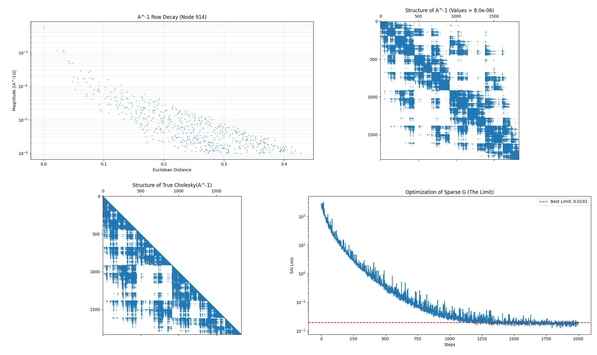

# Project Update: Learning-Based Preconditioning for Real-Time Fluid Simulation

## I. Problem Setup and Governing Equations

The system simulates incompressible flow governed by the Euler equations, discretized via a hybrid Fluid Implicit Particle (FLIP) method. The simulation domain is bounded by a dynamic octree grid structure. The governing equations are split into an advection step (Lagrangian) and a pressure projection step (Eulerian):

$$\frac{\partial \mathbf{u}}{\partial t} + \mathbf{u} \cdot \nabla \mathbf{u} = -\frac{1}{\rho} \nabla p + \mathbf{g}, \quad \quad \nabla \cdot \mathbf{u} = 0$$

The bottleneck of this simulation is the pressure projection, which enforces the divergence-free condition. This requires solving the Poisson equation $\nabla \cdot \nabla p = \frac{\rho}{\Delta t} \nabla \cdot \mathbf{u}^*$, which discretizes into a large linear system $A \mathbf{x} = \mathbf{b}$. Here, $A$ is the discrete Laplacian, $\mathbf{x}$ is the pressure field, and $\mathbf{b}$ is the divergence of the intermediate velocity field.

### Dynamic Octree Discretization

Unlike uniform grids, I utilize a sparse octree structure (managed in `FluidOctree.cs` and `Nodes.compute`). The grid adapts dynamically every frame, with the highest resolution ($maxLayer$) concentrated exclusively at the fluid-air interface and solid boundaries.

- *Computational Advantage:* This approach drastically reduces the degrees of freedom ($N$) compared to a uniform grid, enabling high-effective resolution within a real-time budget (currently maintaining $\sim$24 FPS with 1 million particles).
- *Numerical Challenge:* The octree introduces "hanging nodes" at T-junctions where cells of different refinement levels meet. To maintain stability, the system enforces a 2:1 balance constraint. However, the irregular stencil and varying cell sizes significantly degrade the condition number $\kappa(A)$, making standard Conjugate Gradient (CG) solvers converge slowly.

### Density Correction (Fickian Diffusion)

To mitigate the particle clumping artifacts common in pure FLIP simulations, I incorporate a lightweight Fickian diffusion term. Density gradients ($\nabla \rho$) are computed on the octree nodes, and a corrective velocity is applied to push particles from high-density regions to low-density regions, preserving a uniform particle distribution without the cost of a full SPH density solve.

## II. System Architecture and Engineering

The system is a custom implementation built from scratch, bypassing standard physics engines to allow for total control over memory layout and kernel execution. The pipeline consists of over 70 custom compute shader kernels handling everything from data structure maintenance to linear algebra.

### 1. GPU-Native Data Structures

To support the dynamic topology, the system relies on a Z-curve (Morton code) spatial hashing scheme.

- *Parallel Radix Sort:* A custom GPU Radix Sort (`RadixSort.compute`) was implemented based on the Blelloch scan algorithm. It utilizes a 4-pass approach (8 bits per pass) with local shared-memory histograms to efficiently reorder millions of particles every frame.
- *Prefix Sums & Compaction:* The octree construction relies on parallel prefix sums (`NodesPrefixSums.compute`) to efficiently allocate nodes and compact active lists without CPU readbacks.
- *Topology Handling:* Kernels such as `FindReverseConnections` and `InterpolateFaceVelocities` manage the complex neighbor relationships inherent to the 2:1 balanced octree, handling up to 24 potential neighbor interactions per node (6 faces $\times$ 4 sub-neighbors).
- *Level Set Propagation:* A signed distance field ($\phi$) is computed every frame. The system initializes surface nodes and iteratively propagates distance values inwards using a parallel Fast Sweeping Method (FSM) variant (`PropagatePhi` in `Nodes.compute`), enabling efficient collision handling.

### 2. Matrix-Free Solver with Fused Reductions

The system matrix $A$ is never explicitly assembled. Instead, the operator is applied implicitly via the `ApplyLaplacianAndDot` kernel in `CGSolver.compute`. This kernel fuses the stencil application with the dot-product reduction needed for the CG algorithm using shared memory atomics, minimizing global memory round-trips and synchronization overhead.

### 3. Real-Time Visualization Pipeline

The system includes a complete Screen-Space Fluid Rendering (SSFR) pipeline.

- *Spherical Impostors:* Particles are rendered as camera-facing billboards where per-pixel depth is analytically computed in the fragment shader to represent perfect spheres, avoiding high-poly geometry.
- *Smoothing & Composite:* Separable bilateral filtering is applied to depth textures to smooth the surface, followed by physically based shading (Fresnel, refraction, Beer's Law absorption).

## III. Methodology: Neural Sparse Approximate Inverse

To address the poor conditioning of the octree Laplacian, I am implementing a learned preconditioning strategy. This method builds upon the theoretical framework proposed by Yang et al. (2025) for general matrices, but I have adapted the architecture and implementation specifically for dynamic fluid octrees on the GPU.

### The Preconditioner Formulation

We seek a matrix $M \approx A^{-1}$ to precondition the CG solve. The approximate inverse is modeled as a factorized sparse matrix $M = G G^T + \epsilon I$, where $G$ is a lower-triangular matrix sharing the sparsity pattern of the local stencil. This guarantees that $M$ is Symmetric Positive Definite (SPD), a strict requirement for PCG stability.

### Windowed Transformer vs. GNNs

A key distinction in this implementation is the choice of network architecture. While previous works often utilize Graph Neural Networks (GNNs), GNNs are suboptimal for real-time GPU inference due to irregular memory access patterns.

- *Memory Coalescing:* Since nodes are sorted along the Z-curve, spatially consistent nodes are stored contiguously. The transformer processes fixed-size windows (e.g., 256 nodes), allowing for fully coalesced memory reads.
- *Native Inference Engine:* The inference is run via a custom HLSL kernel (`Preconditioner.compute`). It implements a **Tiled Matrix Multiplication** strategy using `groupshared` memory to cache embeddings and weights, and utilizes `min16float` packing to reduce register pressure and double effective bandwidth.

### Training Strategy (SAI Loss)

The network is trained unsupervised using the Scale-Invariant Aligned Identity (SAI) loss. This loss minimizes the spectral difference between the preconditioned system and the identity matrix using stochastic trace estimation:

$$\mathcal{L} = \mathbb{E}_{\mathbf{w} \sim \mathcal{N}(0, I)} \left[ \left\| \frac{1}{\|A\|_F} A (G G^T + \epsilon I) \mathbf{w} - \mathbf{w} \right\|_2^2 \right]$$

## IV. Current Progress and Validation

The full pipeline—from data generation to training to real-time inference—is functional.

### Structure Analysis & Theoretical Ceiling

Using the `InspectInverse.py` toolset, I analyzed the exact inverse of the octree Laplacian. I went beyond simple decay analysis by running a direct optimization loop to find the "Theoretical Ceiling" for the chosen sparsity pattern—the lowest possible SAI loss achievable by *any* matrix $G$ with the fixed stencil pattern.

**Figure 1: Structural Analysis of the Laplacian Inverse.** (Top-Left) The decay of inverse values $A^{-1}_{ij}$ versus distance confirms that influence is spatially localized, justifying a sparse approximation. (Top-Right) The exact inverse $A^{-1}$ is fully dense, making direct computation infeasible. (Bottom-Left) The ideal Cholesky factor remains too dense for real-time use. (Bottom-Right) Optimization validation: The neural network training loss (0.0170) converges to the theoretical mathematical limit of the sparsity pattern (0.0169), confirming learning efficiency.

As shown in Figure 1, the network has effectively converged to the theoretical limit of the sparsity pattern (0.0169 vs 0.0170). This confirms that the model is not underfitting; any further improvements in convergence would require expanding the sparsity pattern (e.g., to Distance-2 neighbors).

### Performance Benchmarks

Benchmarks run via `TestNeuralPreconditioner.py` demonstrate that the Neural SPAI preconditioner drastically reduces iteration counts compared to standard industry baselines.

| **Comparison** | **Metric** | **Reduction** | **Value Change** |
|----------------|------------|---------------|------------------|
| **vs. Jacobi (Standard)** | CG Iterations | **44.6%** | $56 \rightarrow 31$ |
| | Solve Time | 17.9% | $28\text{ms} \rightarrow 23\text{ms}$ |
| **vs. Raw CG (None)** | CG Iterations | **74.6%** | $122 \rightarrow 31$ |
| | Solve Time | 75.0% | $92\text{ms} \rightarrow 23\text{ms}$ |

- The system runs at interactive rates (24 FPS) with the neural network inference integrated into the time-step.
- The inference cost is currently offset by the reduction in CG iterations, validating the efficiency of the custom HLSL implementation.

## V. Planned Investigation and Component Analysis

Moving forward, the research will focus on optimizing the trade-off between inference complexity and solver convergence.

### Sparsity Pattern Optimization

Currently, $G$ is restricted to the sparsity pattern of $A$ (immediate neighbors). I plan to investigate expanding the sparsity pattern to include "Distance-2" neighbors. This would increase the expressive power of the approximation and potentially handle the T-junction discontinuities better, but comes with a higher compute cost per CG iteration.

### Octree-Aware Architectures

I intend to extend the Transformer architecture to be explicitly "Octree-Aware." By utilizing the hierarchical information already present in the node structure, we can introduce communication between windows or across hierarchy levels. This mimics the behavior of Geometric Multigrid (V-Cycle) methods, potentially capturing global pressure modes that local windows miss.

### Comparative Analysis

To rigorously validate the method, I will implement two additional baselines for comparison:

1. *Graph Neural Networks:* Implementing the GNN approach from the reference paper to quantify the specific performance gains provided by the Windowed Transformer's memory-aligned access.
2. *Algebraic Multigrid (AMG):* While difficult to implement on GPUs for dynamic grids, AMG represents the standard for convergence speed and serves as the primary benchmark for iteration reduction.
